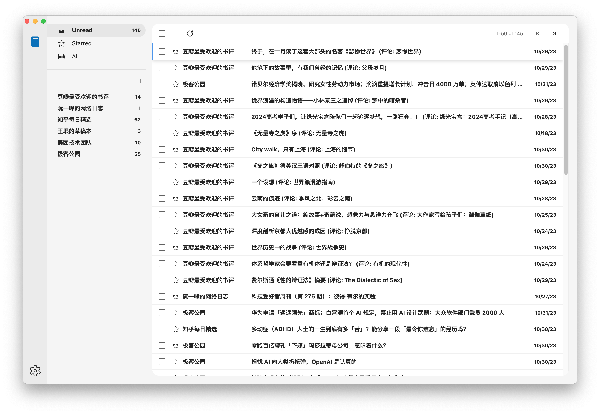

# emo
[Download](https://github.com/xwcoder/emo/releases) | [Issue](https://github.com/xwcoder/emo/issues/new)

I wish to develop **emo** as an **all in one** desktop application. Now, it includes the following apps:
  - **Reader** - A rss reader.

## Features
- Support dark mode.
- Support i18n (English and Simplified).
- Support data sharing and synchronization between devices using cloud storage.

## Reader

### Keyboard shortcus
- g then i: Go to Unread items
- g then s: Go to Starred items
- g then a: Go to All items
- \* then a: Select all items
- \* then n: Deselect all items
- x: Select/Deselect item
- s: Toggle star
- j: Next item
- k: Previous item
- o: Open item
- u: Close item
- v: Open item in browser
